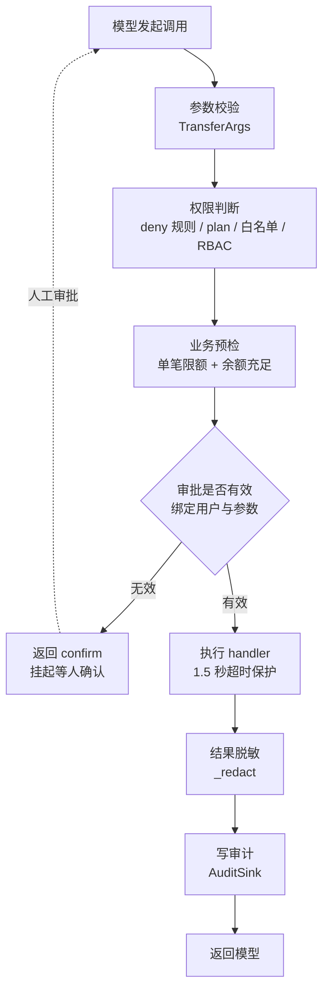

# Week 02 · 工具治理与权限状态机

AI Agent 全栈工程师训练营第二章作业：在训练营提供的工具治理框架上新增一个「转账」工具，
把 **参数校验 → 业务预检 → 权限判断 → 人工审批 → 超时处理 → 结果脱敏 → 审计追踪** 这条链路完整跑通。

框架代码（`tool_governance_demo.py` 中的权限状态机与执行运行时）和基线测试
（`tests/test_tool_governance.py` 的前 8 个用例）由训练营提供。
本仓库新增的部分是：转账工具的实现、追加在原版测试末尾的 5 个转账测试、全文中文注释、三份文档，
以及一份行为对齐的 **Go 复刻**（见 [go/](go/)）。

---

## 快速开始

需要 Python 3.11+（用到了 `StrEnum` 和 `asyncio.timeout`）。

```bash
uv venv --python 3.12 .venv
uv pip install --python .venv/bin/python pydantic pytest pytest-asyncio
```

跑离线演示，九次调用覆盖治理链路的主要分支：

```bash
.venv/bin/python tool_governance_demo.py
```

转账相关的三行输出分别对应三种结局：

```
call_07  confirm  APPROVAL_REQUIRED  参数与权限都没问题，但高风险写操作必须先问人
call_08  allow    OK                 带审批重放，执行成功，返回 ACC-A-****3456
call_09  deny     EXCEED_LIMIT       同一张审批换了金额，先被业务预检挡住
```

作业验收命令，只跑 5 个转账测试：

```bash
.venv/bin/python -m pytest tests/test_tool_governance.py -v -k transfer
```

跑全部 13 个（原版 8 个 + 转账 5 个）：

```bash
.venv/bin/python -m pytest tests/test_tool_governance.py -v
```

---

## 治理链路



完整时序图（含审批绑定与超时分支）见 [docs/transfer_sequence.md](docs/transfer_sequence.md)。

---

## 作业完成情况

| 任务 | 实现位置 | 说明 |
|---|---|---|
| 1 模拟账户数据 | `ACCOUNTS` | key 为 `(tenant_id, account_id)`，tenant_a 三个账户、tenant_b 一个 |
| 2 转账参数模型 | `TransferArgs` | 账号正则 `^ACC-[A-Z]-[0-9]{6}$`，金额 `0 < amount <= 100000`，保留 `extra="forbid"` |
| 3 业务预检 | `transfer_precheck` | 先查限额（`EXCEED_LIMIT`）再查余额（`INSUFFICIENT_BALANCE`），只判断不改账本 |
| 4 转账处理 | `transfer_handler` | 超时模拟、转入账户校验（`ACCOUNT_NOT_FOUND`）、扣款入账、返回流水号 |
| 5 注册工具 | `build_tools()` | `ToolPolicy(WRITE, HIGH, "transfer:execute", 需审批, 1.5s, 不重试, 非幂等)` |
| 6 结果脱敏 | `_redact` | 邮箱脱敏之后追加账号掩码：`ACC-A-123456 → ACC-A-****3456` |

约束遵守情况：

- `PermissionEngine.decide` 的可执行代码一行未改（只增加了说明性注释，已用 token 比对验证）
- 所有测试调用都经过 `ToolRuntime.invoke`，没有直接调 handler
- `TransferArgs` 的 `extra="forbid"` 保留

---

## 测试

`tests/test_tool_governance.py` 分两段：前 8 个是训练营原版用例，逐字未改；末尾追加 5 个转账测试，
写法沿用原版（`async` 用例 + `@pytest.mark.asyncio` + 开头 `reset_side_effects()`）。
原版用例依赖 `pytest-asyncio`。

作业新增的 5 个转账测试，对应链路上的五个观察点：

| 测试 | 验证什么 |
|---|---|
| `test_transfer_schema_rejects_invalid_arguments` | 格式错、金额越界、多传字段全部 `INVALID_ARGUMENT`，账本零变化 |
| `test_transfer_precheck_denies_over_limit_and_insufficient_balance` | 限额与余额拦截，且审计里只有 decision 阶段记录 |
| `test_transfer_requires_approval_then_executes_with_redacted_accounts` | 先 `confirm` 后放行，余额正确增减，返回值中账号已脱敏，审计三条记录顺序正确 |
| `test_transfer_approval_is_bound_to_canonical_arguments` | 改金额、换用户都退回 `confirm`；审批一次性，重放失效 |
| `test_transfer_timeout_reports_unknown_without_side_effects` | 非幂等写操作超时返回 `TIMEOUT_UNKNOWN`，账本未变 |

训练营原版的 8 个用例在加入转账工具后依然全部通过。

---

## 项目结构

```
.
├── tool_governance_demo.py          治理框架 + 四个工具（含转账），全文中文注释
├── conftest.py                      让 pytest 两种启动方式都能导入根目录模块
├── tests/
│   └── test_tool_governance.py      原版 8 个基线测试 + 追加的 5 个转账测试
├── docs/
│   ├── reading_guide.md             阅读指南：五步阅读顺序 + 五个破坏性实验
│   └── transfer_sequence.md         时序图（mermaid）
└── go/                              Go 复刻，行为与 Python 版对齐
    ├── cmd/demo/                    离线演示入口
    └── governance/                  框架与工具实现 + 14 个测试（原版 8 + 转账 5 + Go 独有 1）
```

`tool_governance_demo.py` 的分区：

| 区段 | 内容 |
|---|---|
| 一～二 | 枚举常量、执行上下文、工具策略 |
| 三～四 | 工具参数模型、工具定义与框架内部结构 |
| 五 | 审批摘要、审批库、审计口、脱敏 |
| 六 | 权限状态机（九步固定优先级，作业禁止改动） |
| 七 | `ToolRuntime`：一次调用的四个阶段 |
| 八～九 | 模拟数据、四个工具实现、运行时组装 |
| 十 | 离线演示与可选的 DeepSeek Agent Loop |

---

## 怎么读这份代码

建议按 [docs/reading_guide.md](docs/reading_guide.md) 的顺序：先读类型定义，再读 `ToolRuntime.invoke` 的四个阶段，
然后是 `PermissionEngine.decide` 的九步优先级，最后才看转账那四段业务代码。

指南里还有五个实测过的破坏性实验——把某一层删掉，看哪个测试变红，这是理解治理框架最快的方式。

代码里的注释针对 Go 背景读者做了语法对照（`dataclass` ≈ struct、`asyncio.timeout` ≈ `context.WithTimeout`、
异常 ≈ `if err != nil` 的位置等），文件开头有一张完整对照表。

---

## Go 版

[go/](go/) 下是同一套设计的 Go 实现，九次演示调用的输出、错误码、脱敏结果和审计条数都与 Python 版一致。

```bash
cd go && go run ./cmd/demo
```

```bash
cd go && go test ./governance/ -v -run Transfer
```

测试与 Python 版一一对应：原版 8 个基线测试移植在 `governance_test.go`，5 个转账测试在 `transfer_test.go`。

值得对照着看的是三处语言层面的真实差异（详见 [go/README.md](go/README.md)）：

1. **参数校验**：没有 pydantic，拆成 `DisallowUnknownFields` + 手写 `Validate()`
2. **超时语义**：Go 不能中断 goroutine，超时只是"放弃等待"而非"取消执行"——
   `timeout_semantics_test.go` 用一个不看 `ctx` 的 handler 把这件事跑了出来，
   这正是 `TIMEOUT_UNKNOWN` 存在的理由
3. **并发安全**：Python 单线程事件循环不用锁，Go 的账本、审批库、审计口都必须加锁，`go test -race` 干净

---

## 可选：接真实模型

```bash
export DEEPSEEK_API_KEY=sk-xxx
.venv/bin/python tool_governance_demo.py --agent --input "请查询订单 ord_1001 的状态和可退金额"
```

模型吐出来的每一次 `tool_calls` 同样走 `runtime.invoke`，治理链路一步不少。
演示里只放开了只读工具，模型碰不到退款和转账。
