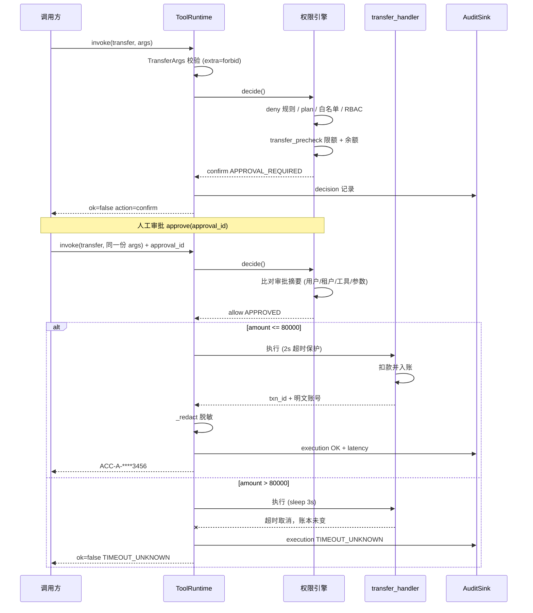

# 转账工具治理链路时序图

对应实现：`tool_governance_demo.py` 的 `transfer` 工具，测试见 `tests/test_tool_governance.py`。

## 三个关键点

1. **审批绑定参数**：`_approval_digest(tool_name, arguments)` 把用户、租户、工具名和全部参数一起做哈希。改一分钱、换个用户都会退回 `confirm`，并且审批用过即作废。
2. **脱敏在 runtime，不在 handler**：`transfer_handler` 返回明文账号，`ToolRuntime` 在 finalize 阶段统一走 `_redact`。放在 runtime 这一层，以后新增的工具才不会漏掉脱敏。
3. **超时返回 `TIMEOUT_UNKNOWN` 而不是 `TIMEOUT`**：`transfer` 的 `idempotent=False`。sleep 排在改余额之前，这次确实没扣钱，但 runtime 无权做这个假设，对调用方只能承认"结果未知"。
